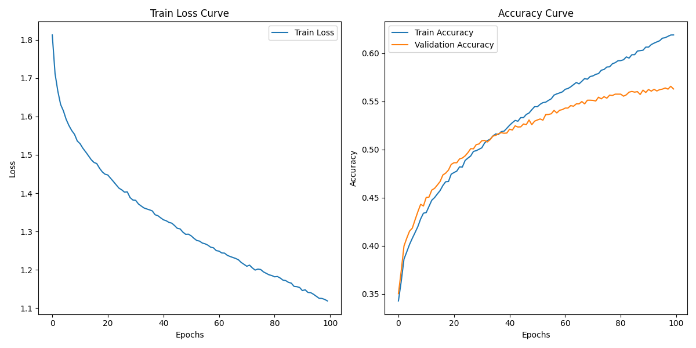

# Facial Emotion Recognition
Facial emotion recognition is made up of `face detection` and `facial emotion classification`.

## Handbook
* Dataset lies in `data` folder.
  * `DataPrepare`: process `target dataset` suitable for training your model.
    - Now the functions are just support for the format of `fer2013`.
* Each model has one independent folder to put model architecture code.
* If you want to add new `dataset` or `model` for contribution, please obey the directory architecture.

## CNN
For an easy start, we tried `CNN (VGG)` on dataset `fer2013` at the beginning.
* First trial: Three convolutional layers architecture (`CNN/FaceCNN.py`)
  - We met `overfitting`: training accuracy is up to 99%, but validation accuracy is below 60%.
    - we begin thinking the reason behind:
      - too many parameters, but never get the core, learnt something related to noises.
* Second trial: Pre-trained VGG in torchvision (`CNN/VGG.py`)
  * 
  * forgot to add plot for `val_loss`.
  * LJC proposed two issues:
    * `batch-size 128` is too large so overfitting occurs.
    * `dataset splitting first 70% as training dataset` is not reasonable: non-balance label allocation.

## Collaborate with us
Pull before push: `git pull --rebase origin master`;
Then push: `git push origin master`